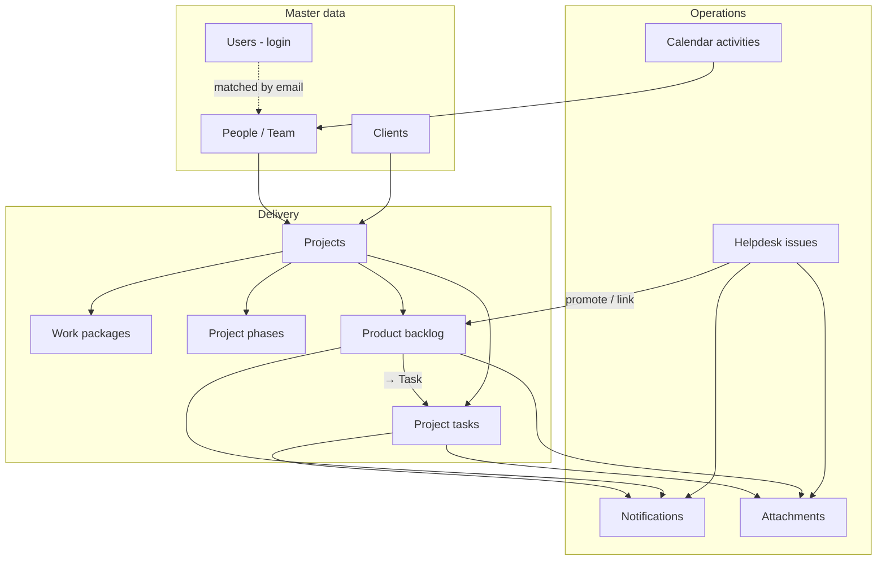
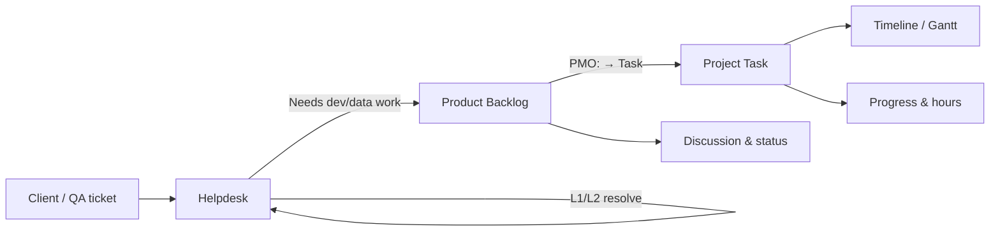
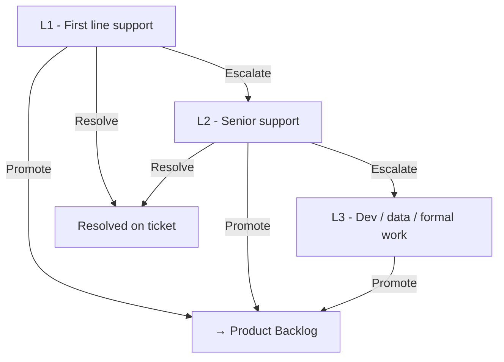

# PMO-CTSB — System Workflow Guide

This document explains **how the whole system fits together**: who does what, how work moves from a client ticket to delivery and billing, and where each module lives in the app.

**Audience:** PMO officers, team leads, developers, support staff, and stakeholders learning the platform.

---

## Table of contents

1. [What the system is for](#1-what-the-system-is-for)
2. [Users and roles](#2-users-and-roles)
3. [Core data relationships](#3-core-data-relationships)
4. [The main delivery pipeline](#4-the-main-delivery-pipeline)
5. [Helpdesk (eTicket)](#5-helpdesk-eticket)
6. [Product backlog](#6-product-backlog)
7. [Project workspace](#7-project-workspace)
8. [Tasks and timeline](#8-tasks-and-timeline)
9. [Calendar and activities](#9-calendar-and-activities)
10. [My Work — personal queue](#10-my-work--personal-queue)
11. [Delivery, finance, and payments](#11-delivery-finance-and-payments)
12. [Notifications](#12-notifications)
13. [Attachments](#13-attachments)
14. [Linking rules (eTicket ↔ backlog)](#14-linking-rules-eticket--backlog)
15. [End-to-end example](#15-end-to-end-example)
16. [Module map (navigation)](#16-module-map-navigation)
17. [Quick reference tables](#17-quick-reference-tables)

---

## 1. What the system is for

PMO-CTSB is a **project portfolio and delivery platform** designed for government and PBT-style engagements. It connects:

- **Client agencies** (DBKL, MOH, universities, etc.)
- **Delivery projects** (contracts, letters of offer, purchase orders, tenders)
- **Operational support** (helpdesk / eTicket)
- **Planned work** (product backlog and tasks)
- **Team schedule** (calendar, site visits, UAT, go-live)
- **Billing** (phase milestones and finance views)

The intended mental model:

> **Intake on Helpdesk → Prioritize on Backlog → Execute as Tasks → Track on Timeline → Schedule on Calendar → Bill via Delivery/Finance**

---

## 2. Users and roles

| Role | Typical person | What they do in the system |
|------|----------------|------------------------------|
| **Admin** | IT / system owner | Users, settings, audit history, full access |
| **PMO** | Project manager, delivery lead | Create projects, assign helpdesk, manage backlog, promote to tasks, calendar, reports |
| **Finance** | Accounts / billing | Finance module, payment milestone visibility |
| **Team member** (`user`) | Developer, BA, QA, support | **My Work**, assigned tickets/backlog/tasks, view calendar |
| **HR** | (optional) | User support |

### Team roster vs login accounts

- **People** (`Team` page) = delivery roster (name, email, role).
- **Users** (`System users`) = login accounts.
- The system matches them by **email** or **name** so notifications and “My Work” know who you are.

### Project roster

People are assigned to projects via **project assignments** (role on project, allocation %). This roster is used for backlog @mentions and project visibility.

---

## 3. Core data relationships



**One project** can have many work packages, backlog items, tasks, phases, and linked helpdesk tickets.

---

## 4. The main delivery pipeline

This is the **most important flow** to understand.



| Stage | Where | Purpose |
|-------|--------|---------|
| **Intake** | Helpdesk | Log, assign, escalate, resolve at support level |
| **Planning** | Product backlog | Prioritize, estimate hours, assign owner |
| **Execution** | Tasks | Plan dates, track progress, complete work |
| **Visibility** | Gantt / Timeline | Portfolio and project schedules |
| **Operations** | Calendar | Meetings, UAT, FAT, outstation, go-live |

**Rule of thumb:**

- If support can **fix it on the ticket** → stay on Helpdesk (resolve).
- If it needs **development, data work, or formal delivery** → **Backlog** → **Task**.

---

## 5. Helpdesk (eTicket)

**URL:** `/helpdesk`

**Purpose:** Operational support queue aligned with legacy **eTicket** fields (ticket number, module, client, external ref, support level, etc.).

### Ticket statuses

| Status | Meaning |
|--------|---------|
| Open | New or not yet worked |
| In progress | Assignee is working on it |
| Waiting agency | Blocked on client / agency |
| Resolved | Closed at the current support level |

### Support levels (L1 → L2 → L3)



| Level | Typical handling |
|-------|------------------|
| **L1** | Password resets, how-to, basic troubleshooting |
| **L2** | Deeper analysis, configuration, recurring issues |
| **L3** | Defects, data fixes, changes needing backlog/task tracking |

### Who can promote Helpdesk → Backlog?

- PMO / Admin
- Ticket **reporter** (person who logged it)
- Any **rostered team member**

L1 can promote **directly** to backlog without going through L2/L3 first (when work clearly needs dev/data).

### Promote to backlog — what happens?

1. User selects target **project** (if not already linked).
2. System **creates** a new backlog item **or links** to an existing one (see [Linking rules](#14-linking-rules-eticket--backlog)).
3. Issue status moves to **in progress** (linked to delivery).
4. **Attachments** copy from issue → backlog.
5. **Assignee** on the backlog is notified.
6. **Creator** (who promoted) is stored for later status notifications.

### Helpdesk notifications

| Event | Who is notified |
|-------|-----------------|
| Ticket assigned | Assignee |
| Promoted to backlog | Backlog assignee |

---

## 6. Product backlog

**URL:** `/projects/{id}?tab=backlog`

**Purpose:** Prioritized work list per project — original scope, CRs, bugs, enhancements, data work, support items.

### Backlog item types

| Type | Use for |
|------|---------|
| Original scope | Contract / URS work |
| Change request (CR) | Approved CR |
| Bug / Defect | Functional or quality issues |
| Enhancement | Improvements |
| Data | Migration, cleansing |
| Support | Technical inquiries carried into delivery |
| Recurring | Repeat issues |

### Backlog statuses

| Status | Meaning | Typical next step |
|--------|---------|-------------------|
| **Open** | Queued, not started | Assignee picks up → In progress |
| **In progress** | Work underway | Complete → Fixed |
| **Fixed** | Work done, awaiting verification | PMO/client confirms → Closed |
| **Closed** | Verified or no further action | Archive |

### Permissions

| Action | PMO | Assignee |
|--------|-----|----------|
| Create backlog item | ✓ | — |
| Set assignee, priority, estimates | ✓ | — |
| Update **status** | ✓ | ✓ |
| Update **actual hours** | ✓ | ✓ |
| Post comments, @mention team | ✓ | ✓ (if on project roster) |
| **→ Task** (promote to task) | ✓ | — |
| Attach files / links | ✓ | ✓ (view); upload per module rules |

### Discussion and @mentions

Each backlog item has a **comment thread**. Type `@` + team member name to mention someone on the project roster.

| Event | Who is notified |
|-------|-----------------|
| Backlog created / assigned | **Assignee** |
| Status changed | **Creator** (who created or promoted the item) |
| New comment | Creator, assignee |
| @mention in comment | Mentioned person |

**Deep link:** `/projects/{projectId}?tab=backlog&backlog={id}`

### Promote backlog → Task

PMO clicks **→ Task** when work is ready for scheduling and tracking.

1. Creates a **project task** (title, hours, assignee, `backlog_id`).
2. Sets backlog to **In progress** and stores `task_id`.
3. Copies **attachments** backlog → task.
4. Notifies **task assignee** (in-app; email if SMTP configured).

---

## 7. Project workspace

**URL:** `/projects/{id}`

Each project is a **delivery workspace** with tabs:

| Tab | Purpose |
|-----|---------|
| **Overview** | Health, KPIs, charts, summary |
| **Work packages** | Split large projects (Portal, API, Migration, …) |
| **Backlog** | Product backlog for this project |
| **Tasks** | Task list and hierarchy |
| **Delivery** | Phases (URS, UAT, FAT, go-live) and payment status |
| **Timeline** | Mini Gantt for this project |
| **People** | Who is assigned and allocation % |

### Work packages

Use when one contract has **multiple delivery streams**. Filter backlog and tasks by package.

### Engagement types

Projects can be tagged as Contract, Letter of offer, Purchase order, Tender, etc. — affects how phases and finance are interpreted.

---

## 8. Tasks and timeline

**URLs:**

- Project tasks: `/projects/{id}?tab=tasks`
- Portfolio Gantt: `/gantt`
- Project timeline: `/projects/{id}?tab=timeline`

### Task statuses

| Status | Meaning |
|--------|---------|
| New | Not started |
| Ongoing | In progress |
| Done | Complete (typically 100% progress) |

Tasks can be:

- **Leaf tasks** — real work items with assignee, dates, hours.
- **Group tasks** — containers for subtasks (rollup progress).

### Relationship to backlog

- Task may have `backlog_id` — created from **→ Task** on backlog.
- Completing the task does **not** auto-close backlog; PMO/assignee updates backlog status separately (Fixed → Closed).

### Gantt and timeline

- **Gantt** — cross-project view of planned vs actual bars.
- **Timeline** — project-scoped schedule with phases and tasks.

---

## 9. Calendar and activities

**URL:** `/calendar`

**Purpose:** Team schedule — not the same as project tasks, but complements them.

### Activity types

Meeting, Outstation, UAT, URS, FAT, DEMO, Training, Go-live, Tender, Other.

### Who can edit?

**PMO and Admin** can log activities, import Excel, email team schedule.

### Features

- Month view with type filters and KPIs (activity count, active days).
- Click a **day** to pre-fill a new activity (PMO).
- Click an **event** for details, edit, delete, resend email.
- Multi-assignee activities show as **one chip** on the calendar (grouped).
- Import historical schedules from **Excel/CSV**.

### Link to My Work

**My Work → Today** shows calendar activities for the logged-in user.

---

## 10. My Work — personal queue

**URL:** `/my-work`

**Purpose:** Single place for each team member to see **their** work.

| Tab | Shows |
|-----|--------|
| **All** | Combined queue |
| **Tasks** | Assigned project tasks |
| **Backlog** | Assigned open backlog items |
| **Helpdesk** | Assigned open tickets |
| **Today** | Today’s calendar activities |

Items are sorted by urgency (overdue tasks, priority, dates). Each row links to the right project or helpdesk detail.

---

## 11. Delivery, finance, and payments

### Delivery tab (`/projects/{id}?tab=delivery`)

Tracks **project phases** — e.g. URS, Development, SIT, UAT, FAT, Go-live, Warranty.

Each phase can have:

- Target / completed dates
- Progress %
- **Payment milestone** — amount, invoice no, paid date, payment status

### Finance module (`/finance`)

**Roles:** PMO, Admin, Finance.

Portfolio view of:

- Ready to bill
- Invoiced
- Paid & claimed
- Maintenance renewal follow-up

Finance reads from **phase payment fields** on projects — it does not replace your accounting system; it tracks milestone status for PMO.

---

## 12. Notifications

**Bell icon** (top bar) — in-app notifications.

| Type | Trigger |
|------|---------|
| Issue assigned | Helpdesk assignee set |
| Backlog assigned | New backlog or assignee changed |
| Backlog status | Creator notified when assignee changes status |
| Backlog comment / @mention | Creator, assignee, mentioned users |
| Task assigned | Task or backlog→task promote |

**Email** (optional, requires SMTP in settings):

- Task / activity assignment emails
- Team schedule email (monthly from Calendar)

---

## 13. Attachments

Supported on:

- **Helpdesk issue**
- **Product backlog item**
- **Project task**

Types:

- **File upload** (stored server-side)
- **URL link**

**Auto-copy on promote:**

```
Issue ──promote──► Backlog ──→ Task ──► Task
         attachments copy at each step
```

---

## 14. Linking rules (eTicket ↔ backlog)

When promoting or importing, the system avoids duplicates by matching:

| Key | Helpdesk field | Backlog field |
|-----|----------------|---------------|
| Backlog ref | `backlog_ref` (PBLID / BUGID) | `ref_no` |
| Client ticket | `external_ticket_ref` (No Tiket) | `external_ticket_ref` |
| Direct link | — | `issue_id` |

**Behaviour:**

- If a matching backlog exists → **link** issue to it (no duplicate row).
- If not → **create** new backlog with ref from issue or auto-generated module ref (e.g. `ABB-1352`).

This supports alignment with legacy **Product Backlog Johor** / **eTicket** CSV structures without forced bulk import.

---

## 15. End-to-end example

**Scenario:** MBSA user cannot pay assessment tax online.

| Step | Module | Action |
|------|--------|--------|
| 1 | Helpdesk | QA logs ticket `eT-CK-0123`, module Cukai, client MBSA, L1 assignee |
| 2 | Helpdesk | L1 checks logs → escalates to L2 |
| 3 | Helpdesk | L2 confirms code defect → **→ Backlog** on *PBT Citizen Portal* |
| 4 | Backlog | Item created Open, assignee = developer, creator = PMO who promoted |
| 5 | Backlog | Developer sets **In progress**, logs actual hours, comments `@Siti` for BA |
| 6 | Backlog | PMO clicks **→ Task** “Fix payment gateway timeout” |
| 7 | Tasks | Developer completes task → **Done** |
| 8 | Backlog | Assignee sets **Fixed** → PMO sets **Closed** after UAT |
| 9 | Calendar | UAT session and go-live workshop logged same month |
| 10 | Delivery | UAT phase marked invoiced; Finance sees milestone |

---

## 16. Module map (navigation)

| Menu | Route | Role in flow |
|------|-------|----------------|
| Dashboard | `/` | Portfolio health, open CR/bugs |
| Projects | `/projects` | Portfolio list |
| Project workspace | `/projects/{id}` | Backlog, tasks, delivery, timeline |
| Helpdesk | `/helpdesk` | Support intake |
| My work | `/my-work` | Personal queue |
| Calendar | `/calendar` | Team schedule |
| Gantt | `/gantt` | Cross-project timeline |
| Team | `/team` | People and capacity |
| Clients | `/clients` | Agency master data |
| Finance | `/finance` | Payment milestones |
| Reports | `/reports` | Exports |
| Users | `/users` | Login accounts (admin) |
| History | `/history` | Audit log |
| Settings | `/settings/*` | Locations, branding |

---

## 17. Quick reference tables

### Status flows side-by-side

| Helpdesk | Backlog | Task |
|----------|---------|------|
| Open | Open | New |
| In progress | In progress | Ongoing |
| Waiting agency | Fixed | Done |
| Resolved | Closed | — |

### Who creates what?

| Entity | Typically created by |
|--------|----------------------|
| Helpdesk ticket | PMO, support, import |
| Backlog item | PMO, or promote from helpdesk |
| Task | PMO (manual or from backlog) |
| Calendar activity | PMO / Admin |
| Project / phase | PMO / Admin |

### Demo data (local)

```bash
npm run seed:demo
npm run dev
```

| Email | Password | Role |
|-------|----------|------|
| admin@pmo.local | admin123 | Admin |
| pmo@pmo.local | pmo123 | PMO |
| finance@pmo.local | finance123 | Finance |
| ahmadrizal@company.com | user123 | Team member |

Demo seed includes sample projects, helpdesk tickets, backlog links, calendar activities, and notifications.

---

## Related documents

| Document | Description |
|----------|-------------|
| [README.md](../README.md) | Install, deploy, migrations |
| [PMO-CTSB-System-Workflow.pdf](./PMO-CTSB-System-Workflow.pdf) | **This guide as PDF** |
| [PMO-CTSB-Team-Presentation.pdf](./PMO-CTSB-Team-Presentation.pdf) | Team slide deck |
| [PMO-CTSB-Screenshot-Tour.pdf](./PMO-CTSB-Screenshot-Tour.pdf) | UI screenshot walkthrough |

---

*Last updated: June 2026 — reflects Helpdesk → Backlog → Task workflow, backlog statuses (Open / In progress / Fixed / Closed), comments with @mentions, and calendar enhancements.*
